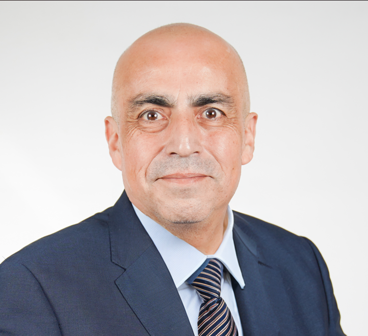

  

  # Víctor Muñoz Flores
  ### **Civil Industrial Engineer & Constructor Civil**
  *Docente Asociado en Duoc UC | Consultor e Ingeniero de Datos*

  

    
    
    
  

---

### 📝 Resumen Ejecutivo
Con más de 20 años de trayectoria en la gestión, ejecución y aseguramiento de calidad (PAC/MOP) en obras civiles e infraestructura. Especialista en la **transformación digital y optimización de procesos técnicos** mediante Ingeniería de Datos, Ciencia de Datos y arquitecturas Cloud, respaldado por credenciales avanzadas de *IBM, Google y Columbia University*. Combinando la docencia universitaria con la transferencia tecnológica aplicada.

---

### 🏛️ Educación Superior & Postgrados
* **Magíster en Ingeniería Industrial** – *Universidad Central de Chile*
* **Magíster en Innovación Curricular y Evaluación** – *Universidad del Desarrollo*
* **Postítulo en Ingeniería Industrial** – *Universidad Central de Chile*
* **Constructor Civil** – *Universidad Católica de la Santísima Concepción*

---

### 🛠️ Core Tecnológico & Especialidades
<table width="100%">
  <tr>
    <td width="50%" valign="top">
      <strong>📊 Data Engineering & Cloud</strong> 
      • Programación avanzada en R (Shiny, Positron) 
      • Bases de datos SQL (PostgreSQL, Supabase) 
      • Pipelines ETL y analítica predictiva con IA
    </td>
    <td width="50%" valign="top">
      <strong>🏗️ Gestión de Infraestructura</strong> 
      • Planes de Aseguramiento de Calidad (PAC/MOP) 
      • Planificación avanzada con MS Project 
      • Modelamiento BIM de Obras Viales (INSTRAM)
    </td>
  </tr>
</table>

---

### 🚀 Ecosistema Digital & Producción Cloud

<table width="100%">
  <tr>
    <td width="50%" align="center" style="background-color: #f8f9fa;">
       <strong>💻 REPOSITORIOS & CÓDIGO</strong> 
      Modelamiento predictivo, analítica e integración de IA. 
      👇 
      <a href="https://victormunoz.github.io" target="_blank"><strong>[ Explorar GitHub IO ]</strong></a>
        
    </td>
    <td width="50%" align="center" style="background-color: #f8f9fa;">
       <strong>📊 SOFTWARE DE PRESUPUESTOS v1</strong> 
      Plataforma en la nube para automatización financiera. 
      👇 
      <a href="https://victormunoz.shinyapps.io/presupuestos_v1" target="_blank"><strong>[ Abrir App en Producción ]</strong></a>
        
    </td>
  </tr>
</table>

---

### 🎥 Apariciones en Medios & Transferencia

> 💡 *Sección en proceso de actualización. Próximamente se integrarán las columnas y entrevistas indexadas de prensa escrita libres de muros de pago.*

#### 📺 Televisión & Contenido Audiovisual
* **Canal de Transferencia Tecnológica (@ProfeVictorProject):** Espacio enfocado en la divulgación técnica, ingeniería, uso de herramientas avanzadas y metodologías para la educación superior.  
    🔗 [Ver Canal de YouTube](https://youtube.com/@ProfeVictorProject)
* *(Aquí agregaremos tus próximas apariciones en televisión con viñetas limpias...)*

#### 📄 Publicaciones Académicas & Working Papers
* **Working Paper:** *Lessons Learned from Chile’s Wood-Burning Heaters Replacement Program* (Muñoz, V.; Olivares, F.; et al.)  
    🔗 [Descargar Documento en PDF](https://fco-olivares.github.io/wp/cs_heaters.pdf)

---

  
<i>"Optimizando la gestión de proyectos de construcción a través de la ciencia de datos y la excelencia académica."</i>

